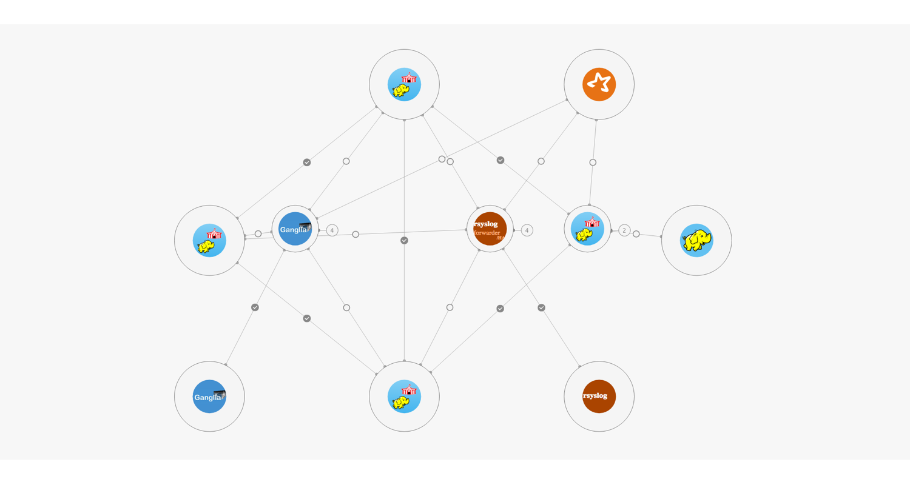
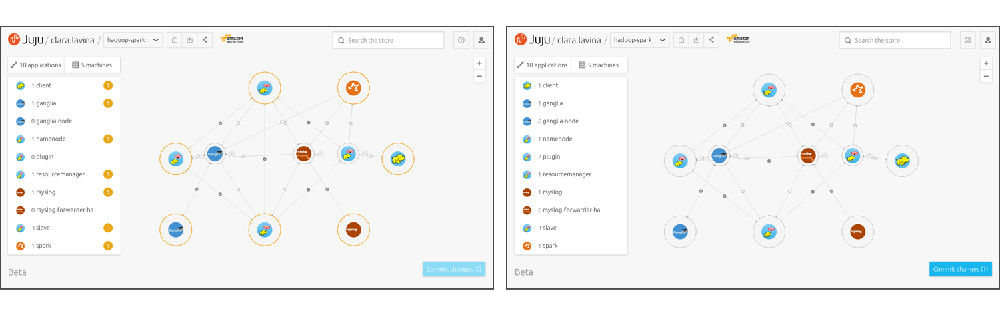
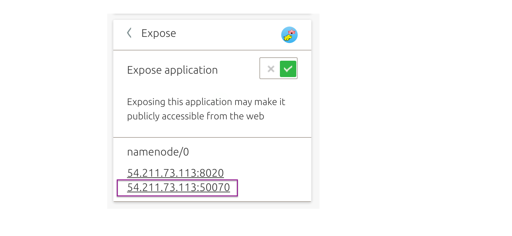
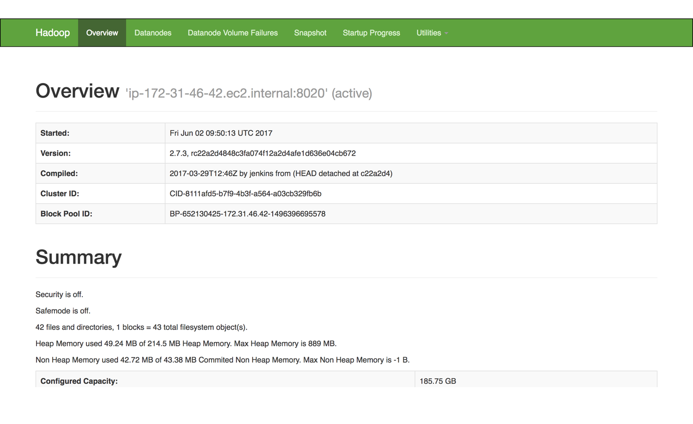
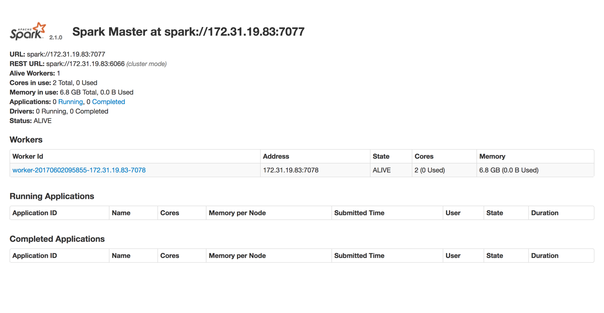
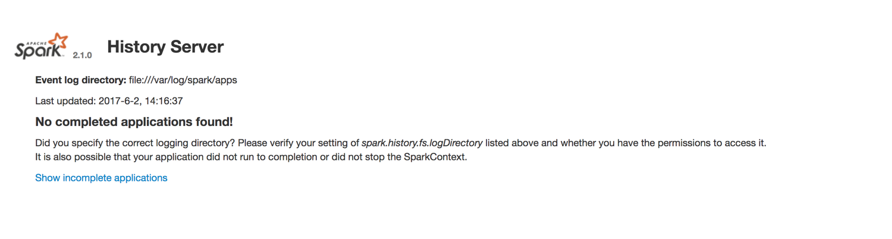
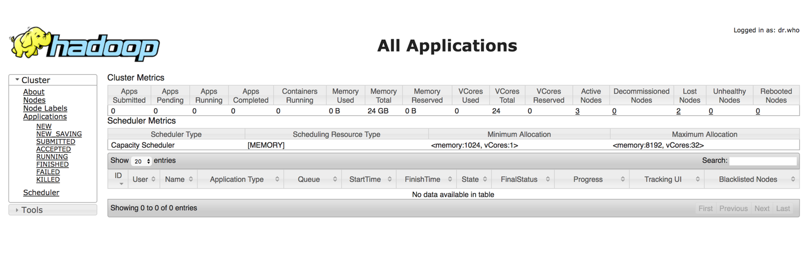
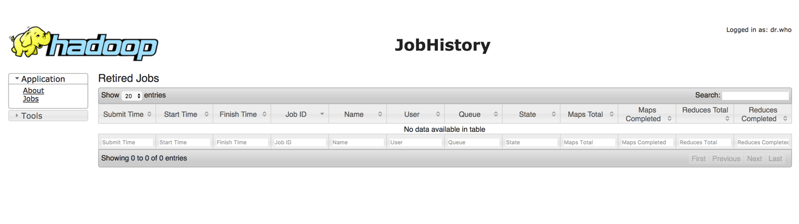
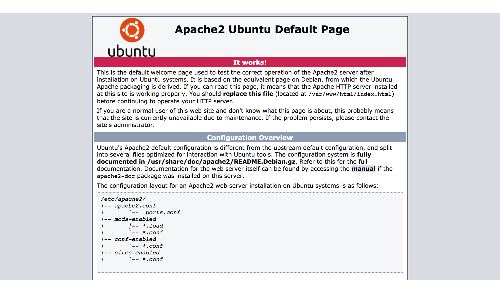

 
 
# Get started with Hadoop Spark
 
## Overview
Duration: 1:00
 
In this tutorial we are going to cover the very basics on how to deploy a big data cluster, that provides a complete deployment of Hadoop and Spark components.
 
This is a five unit big data cluster that includes Hadoop 2.7.3 and Spark 2.1. Use it to analyse batch data with MapReduce or streaming data with Spark.
 
This bundle combines the capabilities of Hadoop and Spark bundles, providing users with a flexible solution consisting of HDFS, MapReduce, and Spark that can process a wide variety of workloads.
 
[Learn more about this bundle.](https://jujucharms.com/hadoop-spark/)
 

 
 
### What you’ll learn
 
- How to get your Hadoop Spark cluster up and running.
- How to operate your cluster.
- Some useful examples to create your first big data workload.
- The different execution modes you can set your Spark cluster.
 
 
### What you’ll need
 
* You have already deployed your [Hadoop Spark cluster](https://jujucharms.com/hadoop-spark/) with JAAS into your preferred cloud.
* You have provided your SSH public key to control your cluster. [If you didn’t provide SSH public key earlier](https://jujucharms.com/docs/2.1/users-auth#credentials-and-ssh-keys).
* Signing in with an Ubuntu One account is required.
* The Juju command line client for Ubuntu, Windows, macOS or CentOS. You can find more info [here](https://jujucharms.com/docs/stable/getting-started#use-the-command-line).
* Some very basic knowledge of command line use, and how to edit files.
 
 
## Getting started
Duration: 1:00
 
 
### About Hadoop Spark
 
Hadoop is designed to scale from a few servers to thousands of machines, each offering local computation and storage. It can also detect and handle failures at the application layer. This provides a highly-available service on top of a cluster of machines, each of which may be prone to failure.
 
Apache Spark is a fast and general engine for large-scale data processing.
 
This bundle provides a complete deployment of Hadoop and Spark components 
 
[Learn more about this bundle.](https://jujucharms.com/hadoop-spark/)
 
 
### Deploying your model with JAAS
 
With JAAS, you don’t need to deal with setup and configuration. All you will need is your preferred cloud credentials.
 
Wait for deployment to complete. This can take up to 20 minutes – pending units are outlined in *orange*. Up and running are outlined in *black*.

 
 
 
## Get your Hadoop Spark cluster up and running
Duration: 5:00
 
1. Select the Namenode charm.

 
2. Select Expose and set the toggle *ON*,  so you can connect to this unit. If deployment has not completed, no public address will be available.

 
3. Click *Commit changes* and *Deploy* to complete the exposing.

 
4. Once deployment is complete, you can visit the **detail of the Hadoop cluster** with your web browser. Click the *second* public IP number and port (e.g. *xxx.xxx.xxx.xxx:50070*). It will open in a new browser tab. 

 
5. You can see detail of the Hadoop cluster to get an overview of the jobs running on your application.

 
 
 
## How to operate your cluster 
Duration: 10:00
 
After the cluster is deployed you may assume control over the cluster from any kubernetes-master, or kubernetes-worker node.
 
Visit the docs to learn more about how to [set up](https://) or how to [get started with Juju](https://jujucharms.com/docs/stable/getting-started). 
 
 
### Juju client
 
Juju is available as a client on many platforms and distributions. Regardless of your operating system, getting all the required tools is very easy.
 
Visit the install docs to get started with [macOS](https://jujucharms.com/docs/stable/reference-install#macos), [Windows](https://jujucharms.com/docs/stable/reference-install#windows) and [CentOS](https://jujucharms.com/docs/stable/reference-install#centos-and-other-linuxes).
 
If you are running **Ubuntu**, you can install it though via:
 
1. It’s helpful to Install Snappy if you don’t have it already. 
`$ sudo apt install snap`
 
2. Install Juju to get the command line client. 
`$ sudo snap install juju --classic`
 
 
### Operating your cluster
 
1. To connect to JAAS from the command line you'll need to register with the JAAS controller. You will be required to do this just the first time.
`$ juju register jimm.jujucharms.com`
 
2. This command will open a new window in your default web browser. Use Ubuntu SSO to authorise your account. You will be asked to enter a descriptive name for the JAAS controller (we suggest *JAAS*). Now you can operate your models or applications in JAAS from the command line. 
To learn more:
`$ juju help`
 
3. Show the models available to you, managed by this controller:
`$ juju models`
 
4. If you have more than one model, switch to the relevant one.
`$ juju switch <model-name>`
 
5. In a terminal, connect to Spark using Juju:
`$ juju ssh spark/0`
 
6. Run the demo workload *sparkpi*, that calculates Pi.
`$ ./sparkpi.sh`
 
7. View your model’s current status:
`$ juju status`
 
8. To watch continuously, in colour, a useful form is:
`$ watch -c juju status --color`
 
 
 
 
## Finally
Duration: 5:00
 
1. Back in the Juju GUI, continue to click on individual charms and expose these useful endpoints, to operate your Spark-Hadoop cluster. Select one by one Spark, Resource Manager and Ganglia, and *Expose* them by setting the toggle *ON*,  so you can connect to this unit.
*Spark*

*Resource Manager*

*Ganglia*

 
2. Click *Commit changes* and *Deploy* to complete the exposing.

 
3. Once deployment is complete, you can visit the relevant endpoints. For *Spark*, open the *first link* (e.g. *xxx.xxx.xxx.xxx:8080*) to open .

The *second link* (e.g. *xxx.xxx.xxx.xxx:18080*) opens the .

 
4. For *Resource Manager*, click the *first link* (e.g. *xxx.xxx.xxx.xxx:8088*) to open the **YARN cluster dashboard**.

The *second link* (e.g. *xxx.xxx.xxx.xxx:19888*) opens the **YARN History Server**.

 
5. For *Ganglia* (not Ganglia-node), visit *xxx.xxx.xxx.xxx/ganglia* to open the **Ganglia web interface**.

 
 
 
 
## Spark execution modes
Duration: 3:00
 
By default, this bundle configures Spark in ‘yarn’ mode.  This allows Spark to use the Hadoop cluster for all compute resources.
 
The Spark execution mode can be changed to use non-Hadoop resources for Spark jobs.  
 
1. For example, switch Spark into *standalone* mode. In standalone mode, Spark launches a Master and Worker daemon on the Spark unit. This mode is useful for simulating a distributed cluster environment without actually setting up a cluster.
`juju config spark spark_execution_mode=standalone`
 
2. Add 2 additional units to form a 3-node Spark cluster:
`juju add-unit -n 2 spark`
 
For more details on the Spark execution modes, visit the [configuration section of the Spark charm](https://github.com/apache/bigtop/tree/master/bigtop-packages/src/charm/spark/layer-spark#spark_execution_mode).
 
 
 
 
## That’s all folks!
Duration: 1:00
 
Congratulations! You made it! 
 
By now you should have up and running your Hadoop Spark cluster, providing you a complete deployment of Hadoop and Spark components.
 

 
 
### Next steps
 
Now that you have your big data cluster, you can learn different examples of how you can put your cluster to work.
 
* [Link name](https://).
* [Link name](https://).
* [Link name](https://).
 
 
### Further reading
 
* Learn more about the [Hadoop Spark](https://jujucharms.com/hadoop-spark/) bundle.
* Discover other [Big Data solutions ](https://jujucharms.com/big-data).
* Get involved and connect with the [Juju Big Data community](http://bigdata.juju.solutions/getstarted?mkt_tok=eyJpIjoiWVdGbFpUSmtaamd4TVRZMyIsInQiOiJZREphTkJraGl4c0JObHR0dGY0UWtQd20wNVwva3VqaWp4VWNaQTRucTZsNlRSYmZhU3NQXC9Ib0NvR3VrZ2VQdFE2V2I2YlBMSmxHamhZNmFSY01GR1J3PT0ifQ%3D%3D).
 
