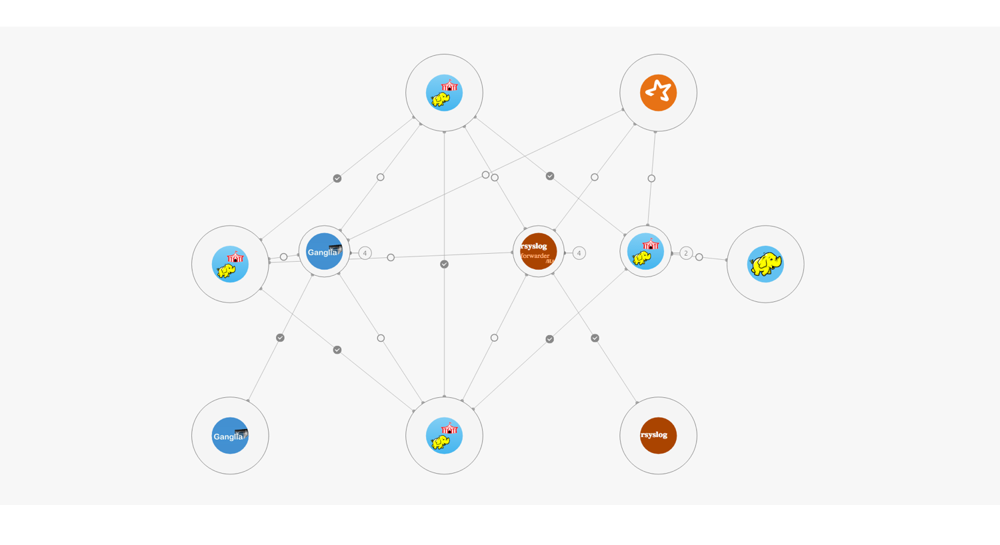
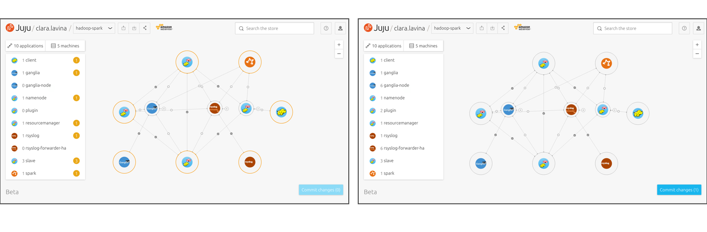
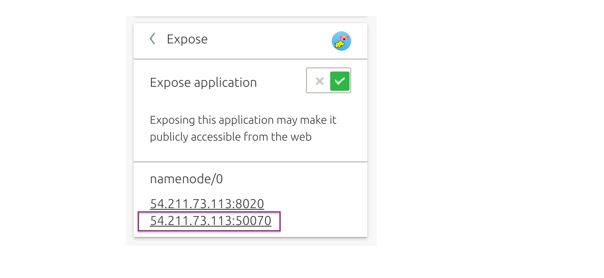
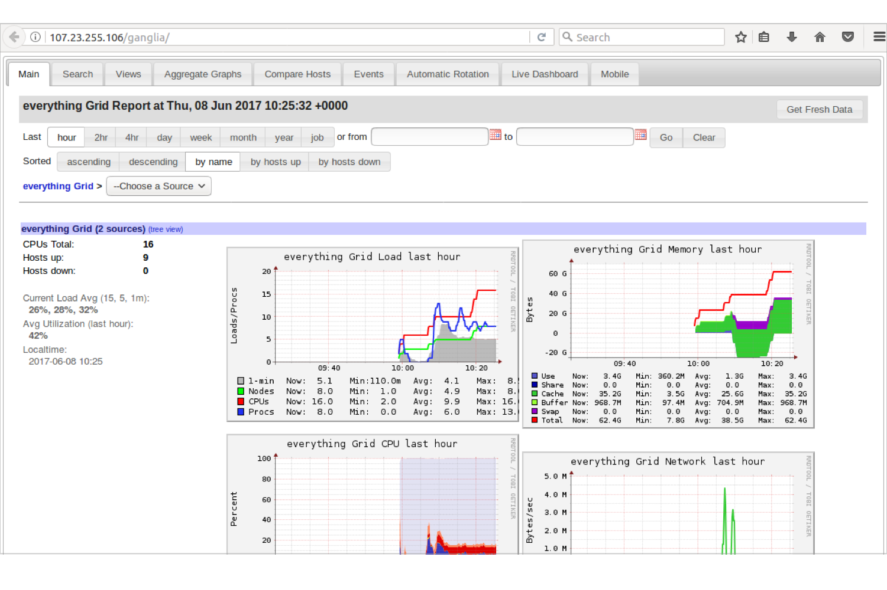

---
 
id: get-started-hadoop-spark
summary: Learn how to operate a big data cluster, to analyse batch data with MapReduce or streaming data with Spark. 
categories: jaas
tags: hadoop, spark, juju, jaas, big data, cloud
difficulty: 2
status: Published
Published: 2017-06-01
 
---
 
 
# Get started with Hadoop Spark
 
## Overview
Duration: 1:00
 
 
### About Hadoop Spark
 
This provides a highly-available (HA) service on top of a cluster of machines, each of which may be prone to failure. It provides a flexible solution consisting of HDFS, MapReduce, and Spark that can process a wide variety of workloads.
 
Hadoop is designed to scale from a few servers to thousands of machines, each offering local computation and storage. It can also detect and handle failures at the application layer. 
 
[Learn more about this bundle](https://jujucharms.com/hadoop-spark/).
 

 
 
### In this tutorial you’ll learn how to...
 
- Get your Hadoop Spark cluster up and running.
- Operate your new cluster.
- Create your first big data workload with some useful examples.
- Set your Spark component into different execution modes.
- Get the Juju command line client for your operating system.
 
 
### You will need...
 
* An [Ubuntu One account](https://login.ubuntu.com/).
* An SSH key in your JAAS account. If you haven’t done this already, [learn how to add your SSH key](https://jujucharms.com/docs/2.1/users-auth#credentials-and-ssh-keys). 
* Basic knowledge of command line.
 
 
 
## Deploying your model with JAAS
Duration: 1:00
 
With JAAS, you don’t need to deal with setup and configuration of Juju. All you will need is your preferred cloud credentials.
 
If you haven’t already deployed the Hadoop Spark bundle, do so by clicking [direct deploy](https://jujucharms.com/new?dd=bundle/hadoop-spark). 
 
Deployment will take several minutes as Juju creates new instances in the cloud and sets up the Hadoop Spark cluster components. Pending units are outlined in *orange*. Up and running are outlined in *black*.

 
 
 
## Getting Started
Duration: 5:00
 
### Install the Juju client
 
**You will need to have Juju installed locally to operate your cluster. Skip this step if you already have it.**
 
Juju is available as a client on many platforms and distributions. Regardless of your operating system, getting all the required tools is very easy. Visit the [install docs](https://jujucharms.com/docs/stable/reference-install#getting-the-latest-juju) to get the latest version of Juju on **macOS**, **Windows** or **CentOS**.
 
If you are running **Ubuntu**, you can install Juju through the following steps:
 
1. It’s helpful to Install Snappy if you don’t have it already. 
`$ sudo apt install snapd`
 
2. Install Juju to get the command line client. 
`$ sudo snap install juju --classic`
 
3. Verify you can run Juju. You will see a summary and a list of common commands.
`$ juju`
 
You’re done! To learn more on how to get started with Juju, visit the [documentation](https://jujucharms.com/docs/stable/getting-started). 
 
For general help in the CLI: 
`$ juju help`
 
 
## Operating your Hadoop cluster 
Duration: 5:00
 
1. Select the **Namenode** charm.

 
2. Select *Expose* in the inspector on the left hand side and set the toggle *ON*,  so you can connect to this unit. If deployment has not completed, no public address will be available.

 
3. Click *Commit changes* and *Deploy* to complete the exposing.

 
4. Once deployment is complete, you can visit the **detail of the Hadoop cluster** with your web browser. Click the link public IP number and port (e.g. *xxx.xxx.xxx.xxx:50070*). It will open in a new browser tab. 

 
5. You can now see a detailed overview of the Hadoop cluster.  

 
 
 
## Running your first workload
Duration: 10:00
 
1. To connect to JAAS from the command line you'll need to register with the JAAS controller. You will be required to do this just the first time.
`$ juju register jimm.jujucharms.com`
 
2. This command will open a new window in your default web browser. Use Ubuntu SSO to login and authorise your account. 
 
3. You will then be asked to enter a descriptive name for the JAAS controller.  We suggest using *jaas*. 
 
4. JAAS users with existing models, might first need to  switch to the relevant model:
`$ juju switch <model-name>`
 
5. In the terminal, run the *sparkpi* demo workload included on the Spark node:
`$ juju run --unit spark/0 /home/ubuntu/sparkpi.sh`

 
6. Your Hadoop Spark cluster is managed as a *model* by Juju. View the model’s status with:
`$ juju status`
 
7. To watch continuously, in colour, a useful form is:
`$ watch -c juju status --color`
 
Visit the docs to learn more about how to [monitor, benchmark, and scale](https://github.com/juju-solutions/bigtop/blob/master/bigtop-deploy/juju/hadoop-spark/README.md).
 
 
 
## Additional interfaces
Duration: 5:00
 
### Spark
 
1. Back in the Juju GUI, in your web browser, click on individual charms and expose these useful endpoints, to operate your Spark-Hadoop cluster. Select **Spark**.

 
2. Select *Expose* in the inspector on the left hand side and set the toggle *ON*,  so you can connect to this unit.

 
3. Click *Commit changes* and *Deploy*.

 
4. Once deployment is complete, you can open the *link* (e.g. *xxx.xxx.xxx.xxx:18080*) to view the Spark Job History interface.

 
 
### Resource Manager 
 
1. Select **Resource Manager** charm.

 
2. *Expose* the charm.

 
3. Click *Commit changes* and *Deploy* to complete the exposing.

 
4. Once is ready, click the *first link* (e.g. *xxx.xxx.xxx.xxx:8088*) to open the **YARN cluster dashboard**, which includes information about the Hadoop compute nodes in your cluster.

The *second link* (e.g. *xxx.xxx.xxx.xxx:19888*) opens the **YARN History Server**, which includes information about Hadoop or Spark jobs submitted to your cluster.

 
 
### Ganglia
 
1. Select **Ganglia** (not Ganglia-node).

 
2. *Expose* the charm.

 
3. Click *Commit changes* and *Deploy*.

 
4. Visit *xxx.xxx.xxx.xxx:80/ganglia* to open the **Ganglia web interface**.  Please note, you will need to append **/ganglia** to the URL to reach the Ganglia interface.

 
 
 
## Spark execution modes
Duration: 3:00
 
By default, this bundle configures Spark in ‘yarn’ mode.  This allows Spark to use the Hadoop cluster for all compute resources.
 
The Spark execution mode can be changed to use non-Hadoop resources for Spark jobs.  
 
1. For example, switch Spark into *standalone* mode. In standalone mode, Spark launches a Master and Worker daemon on the Spark unit. This mode is useful for simulating a distributed cluster environment without actually setting up a cluster.
`$ juju config spark spark_execution_mode=standalone`
 
2. Add 2 additional units to form a 3-node Spark cluster:
`$ juju add-unit -n 2 spark`
 
For more details on the Spark execution modes, visit the [configuration section of the Spark charm](https://github.com/apache/bigtop/tree/master/bigtop-packages/src/charm/spark/layer-spark#spark_execution_mode).
 
 
 
 
## That’s all folks!
Duration: 1:00
 
Congratulations! You now have a Hadoop Spark cluster up and running.
 

 
 
### Next steps
 
SSH to the client node to execute other Hadoop and Spark workloads.
 
1. Step
`$ juju ssh client/0`

2. Step
`$ ./sparkpi.sh`

3. Step
`$ spark-submit --class org.apache.spark.examples.SparkPi  /usr/lib/spark/examples/jars/spark-examples.jar 10`

4. Step
`$ hadoop jar /usr/lib/hadoop-mapreduce/hadoop-mapreduce-examples-*.jar teragen 1000000 teragen_data`

5. Step
`$ exit`
 
 
### Further reading
 
* Learn more about the [Hadoop Spark bundle](https://jujucharms.com/hadoop-spark/).
* Discover other [Big Data solutions ](https://jujucharms.com/big-data).
* Get involved and connect with the [Juju Big Data community](http://bigdata.juju.solutions/getstarted?mkt_tok=eyJpIjoiWVdGbFpUSmtaamd4TVRZMyIsInQiOiJZREphTkJraGl4c0JObHR0dGY0UWtQd20wNVwva3VqaWp4VWNaQTRucTZsNlRSYmZhU3NQXC9Ib0NvR3VrZ2VQdFE2V2I2YlBMSmxHamhZNmFSY01GR1J3PT0ifQ%3D%3D).
 
